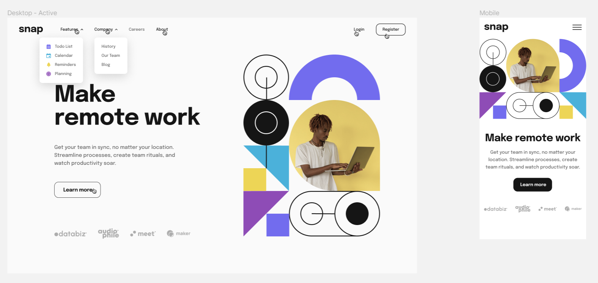
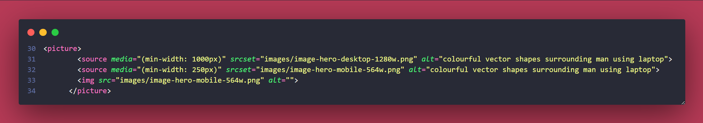

# Frontend Mentor - Intro section with dropdown navigation


## Welcome! 👋

Thanks for checking out this front-end coding challenge.

[Frontend Mentor](https://www.frontendmentor.io) challenges help you improve your coding skills by building realistic projects.

## Table of contents 📜

- [Overview 🔍](https://github.com/JoleneKearse/fem-age-calculator-app#overview-)
  - [The challenge 🚵](https://github.com/JoleneKearse/fem-age-calculator-app#the-challenge-)
  - [Screenshot 📷](https://github.com/JoleneKearse/fem-age-calculator-app#screenshot-)
  - [Links 🖇️](https://github.com/JoleneKearse/fem-age-calculator-app#links-%EF%B8%8F)
- [My process 👩‍💻](https://github.com/JoleneKearse/fem-age-calculator-app#my-process-)
  - [Built with ⚒️](https://github.com/JoleneKearse/fem-age-calculator-app#built-with-%EF%B8%8F)
  - [What I learned 📔](https://github.com/JoleneKearse/fem-age-calculator-app#what-i-learned-)
    - [How to use provided fonts! 🫣](https://github.com/JoleneKearse/fem-age-calculator-app#how-to-use-provided-fonts-)
    - [How to do multiple conditions in an if statment]()
  - [Continued development 🎓](https://github.com/JoleneKearse/fem-age-calculator-app#continued-development-)
  - [Useful resources 🗒️](https://github.com/JoleneKearse/fem-age-calculator-app#useful-resources-%EF%B8%8F)
- [Author 🙃](https://github.com/JoleneKearse/fem-age-calculator-app#author-)

## Overview 🔍

### The challenge 🚵

Users should be able to:

- [x] View an age in years, months, and days after submitting a valid date through the form
- [x] Receive validation errors if:
  - [x] Any field is empty when the form is submitted
  - [x] The day number is not between 1-31
  - [x] The month number is not between 1-12
  - [x] The year is in the future
  - [x] The date is invalid e.g. 31/04/1991 (there are 30 days in April)
- [x] View the optimal layout for the interface depending on their device's screen size
- [x] See hover and focus states for all interactive elements on the page
- [x] **Bonus**: See the age numbers animate to their final number when the form is submitted
- [x] **My Stretch Goal**: Account for leap years.
- [x] **Another Stretch Goal**: Automatically move focus to the next input box after 2 digits are entered.

### Screenshot 📷

Here is the Figma design:


And here's my solution:


I added `YYYY` as a placeholder, as it made more sense to me, and did a simple **animation using classes**.


And here are my error messages in desktop:


### Links 🖇️

- [Github](https://github.com/JoleneKearse/fem-age-calculator-app)
- [Live Site URL](https://fem-age-calculator-app.vercel.app/)

## My process 👩‍💻

### Built with ⚒️

- Semantic HTML5 markup
- `@font-face`
- CSS custom properties
- Flexbox
- Mobile-first workflow

### What I learned 📔

#### How to use `<picture>`

I've tried using the `<picture>` tag and `srcset` before, but to no avail. I started as usual with the [MDN Docs](https://developer.mozilla.org/en-US/docs/Web/HTML/Element/picture), then watched a [video on YouTube](https://www.youtube.com/watch?v=nHB-3WJTfSg). Both of these resources did help, but I still had the _mobile image_ beating out the _desktop one_. 
```html
<picture>
  <source...(mobile)>
  <source...(desktop)>
  
</picture>
```
I tried an empty ``, which worked, but I knew wasn't right.

Finally, I decided to change up the order of my sources and 'Wahoo, everything worked!'



#### How to do multiple conditions in an if statment


### Continued development 🎓

This took me quite a long time, so I will continue to work on **Vanilla JavaScript** projects alongside my **React** learning!

### Useful resources 🗒️

- [Loading a Self-Hosted Font with `@font-face`](https://www.digitalocean.com/community/tutorials/how-to-load-and-use-custom-fonts-with-css#loading-a-self-hosted-font-with-font-face) - This showed me how to use provided fonts via CSS and how to avoid _faux_ rendering.
- [How to Write Good Commit Messages: A Practical Git Guide](https://www.freecodecamp.org/news/writing-good-commit-messages-a-practical-guide/) - This article has a simple listing of commit types. I found it useful to remind me of **style** as I had been using '**feat**' for just about everything, even though that hadn't made sense to me. 🤣


## Author 🙃

Hiya! 👋 My name is **Jolene Kearse**.  

I was an **English as a Foreign Language Teacher** ️🌏🧑‍🏫 for over 15 years - so, yeah, _for a little bit_ 🤌...  I lived all over the world, including China, England & South Korea.

Now I'm an awesome **Software Engineer**! 💃 I'm a **proud, self-taught individual**. 

I'm also proud of how far I came in 2022.  I finally learned **JavaScript**! 🍻 _I had struggled for about a year before I finally could add that to my skillset.  If you're interested in an awesome 🔥 course check out **[Class Central's Bootcamp YouTube Playlist going through freeCodeCamp's Algorithms and Data Structures Certification](https://www.youtube.com/playlist?list=PLU3RKvMpgrSEoqVIV14K_zuinrIBcnCgT).**

Then I met an awesome group of fellow-learning devs, **The Explorers**.  This exposed me to the myriad and oft-confusing ways of using **Git** in a team - loving it now!  But also projects using so many kinds of tech that would've just blown my mind a year before 🤯 including:
- React
- TypeScript
- Tailwind

I even participated in **[#Hacktoberfest](https://hacktoberfest.com/)** and earned the coveted T-shirt! 🎉👕


In *2023* I've been boning up on **React**, and just taking so many courses to learn **Backend Development** and **navigate the process of earning my first tech job**!

One of those courses has seen me going back to **Python** - which I had treated as my _crutch language_ to understand JavaScript.  🤣  But I've been loving navigating in multiple languages.

Another challenge I am undertaking this year is [Exercism's](https://exercism.org/) **#12in23**.  This is a cool 😎 opportunity to _try out_ 12 different languages this year.  Each month has a theme, like **Functional February** and **Mechanical March** to encourage you to check out different language paradims.  I'm loving this chance to dip my toe in other types of programming.  I find I'm gaining the ability to evaluate various languages' strengths and project needs.

Let's connect! 💬

- Frontend Mentor - [Jolene Kearse](https://www.frontendmentor.io/profile/JoleneKearse)
- LinkedIn - [Jolene Kearse](https://www.linkedin.com/in/jolene-kearse-2562ba218/)
- Twitter - [JoleneFromCanada](https://twitter.com/FromJolene)
